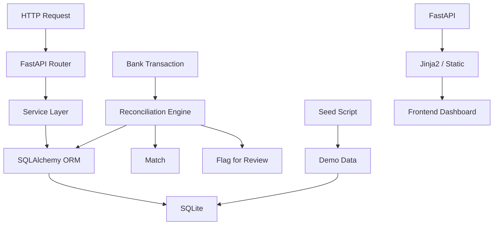

# Architecture

This is the path I had in mind while building the app. Requests hit FastAPI, move through route and service code, and then end up in SQLAlchemy models backed by SQLite. Reconciliation has its own little branch because it looks at bank transactions and open invoices before deciding whether to match or flag something. I also included the seed flow and the small server-rendered dashboard because both matter when someone is trying the project quickly.

